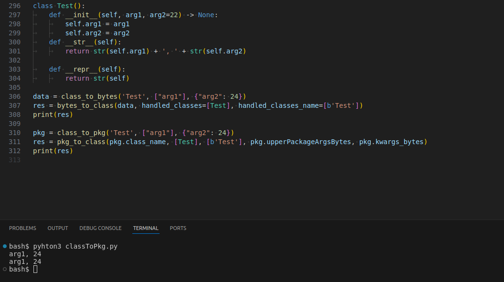
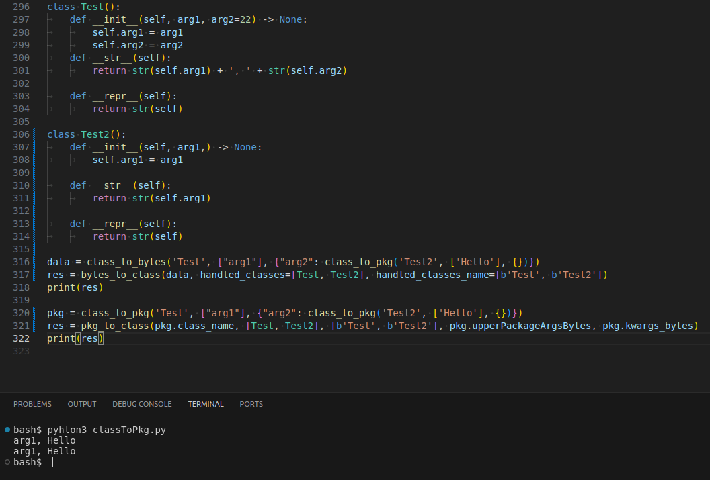

# Class to Package
<a name="readme-top"></a>

<!-- TABLE OF CONTENTS -->
<details>
  <summary>Table of Contents</summary>
  <ol>
    <li>
      <a href="#about-the-project">About The Project</a>
      <ul>
        <li><a href="#built-with">Built With</a></li>
      </ul>
    </li>
    <li><a href="#Execution">Execution</a></li>
  </ol>
</details>


<!-- ABOUT THE PROJECT -->
## About The Project

Those are 2 python functions. one to transform class declaration to bytes.
The otherone to transform bytes to class declaration

<p align="right">(<a href="#readme-top">back to top</a>)</p>

### Built With


<p align="right">(<a href="#readme-top">back to top</a>)</p>

## Execution
* There are 2 way to use it:
  * By passing by bytes:
    * First you have to create bytes:
      ```
      data = class_to_bytes(class_name, [args], {'key1', value1})
      ```
    * Then un-bytes it:
      ```
      cls_instance = bytes_to_class(data, [classes_handled], [classes_handled name in bytes])
      ```
  * Or by passing by package:
    * First you have to create the Package instance:
    ```
    pkg = class_to_pkg(class_name, [args], {'key1', value1})
    ```
    * Then un-Package it
    ```
    cls_instance = pkg_to_class(pkg.class_name, [classes handled], [classes_handled name in bytes], pkg.upperPackageArgsBytes, pkg.kwargs_bytes)
    ```
  Knowing using bytes will go through packages methods, but bytes are more portable
  than a Package instance

* Here's an example on how to use both :


* Here's another example on how to use both with element being special classess themself :


* This code also works for functions, you could replace Classes by functions

<p align="right">(<a href="#readme-top">back to top</a>)</p>